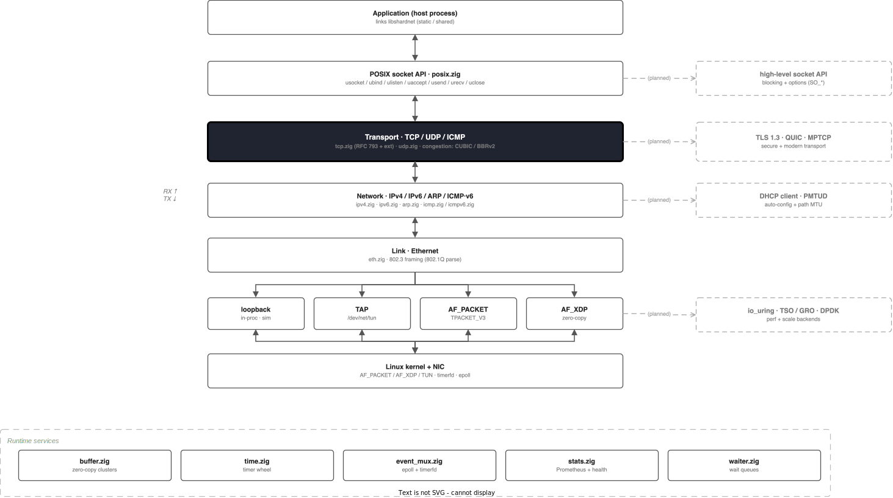
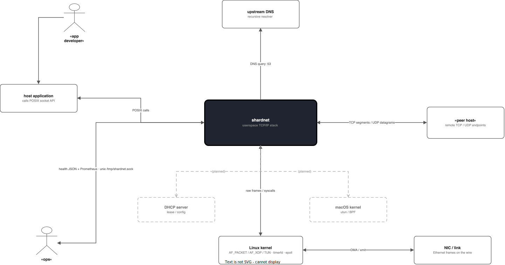

<div align="center">

# Shardnet

**A high-performance userspace TCP/IP stack written in Zig**

[](LICENSE)
[](https://ziglang.org)
[](#platform-support)

</div>

---

Shardnet is a full TCP/IP stack — IPv4/IPv6, TCP, UDP, ICMP/ICMPv6, ARP and DNS — that runs entirely in userspace over pluggable drivers (loopback, TAP, AF_PACKET, AF_XDP). It targets Linux and is built for throughput: modern TCP extensions, CUBIC/BBRv2 congestion control, zero-copy buffers, and a sharded, multi-queue-friendly core.

## Architecture

### Overall Architecture

<p align="center">
  
</p>

### System Context

<p align="center">
  
</p>

## Quick start

```sh
git clone https://github.com/Adel-Ayoub/shardnet.git
cd shardnet

zig build          # static + shared libraries
zig build test     # run the test suite
zig build example  # build example binaries
```

Requires the **Zig 0.14.x** toolchain. Linux has full support; macOS/BSD build with the loopback driver only.

## Features

- **Protocols** — IPv4 (fragment reassembly), IPv6 (extension headers), TCP (RFC 793), UDP, ICMP/ICMPv6 (echo + rate limiting), ARP (cache change detection), DNS (TTL + negative cache + hosts file).
- **TCP extensions** — SACK (RFC 2018), timestamps & window scaling (RFC 7323), Nagle / `TCP_NODELAY` (RFC 896), fast retransmit/recovery (RFC 5681), SYN cookies, keepalive, TIME_WAIT/2MSL.
- **Congestion control** — CUBIC (RFC 9438 + HyStart++), BBRv2, and a pluggable interface for custom algorithms.
- **Drivers** — loopback (testing), TAP, AF_PACKET (TPACKET_V3 block mode), AF_XDP (kernel bypass).
- **Performance** — zero-copy cluster buffers, 256-way sharded transport tables, timerfd timer wheel, pre-warmed memory pools, per-layer stats.
- **Operations** — Unix-socket health check (`/tmp/shardnet.sock`), Prometheus metrics, graceful shutdown.

**In progress:** TSO/GRO · Multipath TCP · QUIC&nbsp;&nbsp;·&nbsp;&nbsp;**Planned:** DPDK driver · eBPF integration · kernel module

## Usage

```zig
const std = @import("std");
const shardnet = @import("shardnet");

pub fn main() !void {
    var gpa = std.heap.GeneralPurposeAllocator(.{}){};
    defer _ = gpa.deinit();

    var stack = try shardnet.init(gpa.allocator());
    defer stack.deinit();

    const tap = try shardnet.drivers.tap.Tap.init("tap0");
    try stack.createNIC(1, tap.endpoint());
    try stack.nics.get(1).?.addAddress(.{
        .protocol = shardnet.tcpip.EtherType.IPv4,
        .address_with_prefix = .{ .address = .{ .v4 = .{ 10, 0, 0, 1 } }, .prefix = 24 },
    });

    stack.run();
}
```

Run the bundled examples and benchmarks (root required for the real drivers):

```sh
sudo ./setup_veth.sh
sudo zig-out/bin/bench_ping_pong -i tap0 -a 10.0.0.1/24
sudo zig-out/bin/example_unified -d af_packet -i eth0 -a 10.0.0.1/24
```

See [`examples/`](examples) for TCP servers, multi-driver setups, and throughput tests.

## Build

| Target | Description |
|--------|-------------|
| `zig build` | Static and shared libraries |
| `zig build test` | Run all tests |
| `zig build bench` | Benchmark binaries (ReleaseFast) |
| `zig build docs` | Generate documentation |
| `zig build example` | Example binaries |

Options: `-Doptimize=ReleaseFast`, `-Dlog_level=<err|warn|info|debug|none>`.

## Platform support

| Platform | Support | Notes |
|----------|---------|-------|
| Linux | Full | All drivers, namespaces, cgroups |
| macOS / BSD | Limited | Loopback only |

## Performance

Indicative single-core numbers (Intel Xeon E5-2680 v4, Linux 5.15):

| TCP throughput | UDP throughput | Ping-pong latency | Connections/sec |
|----------------|----------------|-------------------|-----------------|
| ~8 Gbps | ~10 Gbps | ~15 µs | ~100K |

<details>
<summary><strong>RFC compliance</strong></summary>

| RFC | Title |
|-----|-------|
| 791 / 8200 | IPv4 / IPv6 |
| 792 / 4443 | ICMP / ICMPv6 |
| 826 | ARP |
| 793 | TCP |
| 896 | Nagle algorithm |
| 2018 | TCP SACK |
| 5681 | TCP congestion control |
| 7323 | TCP timestamps & window scaling |
| 9406 | HyStart++ |
| 9438 | CUBIC |

</details>

<details>
<summary><strong>Project layout</strong></summary>

```
src/
├── main.zig            entry point + CLI
├── stack.zig           orchestration, routing, dispatch
├── tcpip.zig           core types and vtables
├── buffer.zig          zero-copy buffers
├── header.zig          protocol headers + checksums
├── time.zig            timer wheel
├── event_mux.zig       epoll + timerfd event loop
├── dns.zig posix.zig stats.zig waiter.zig interface.zig
├── link/eth.zig        Ethernet framing
├── network/            ipv4 · ipv6 · arp · icmp · icmpv6
├── transport/          tcp · udp · congestion/{control,cubic,bbr}
└── drivers/            loopback · linux/{tap,af_packet,af_xdp}
examples/               ping_pong · uperf · main_unified · …
```

</details>

## License

Apache License 2.0 — Copyright (c) 2026 Adel-Ayoub. See [LICENSE](LICENSE).
